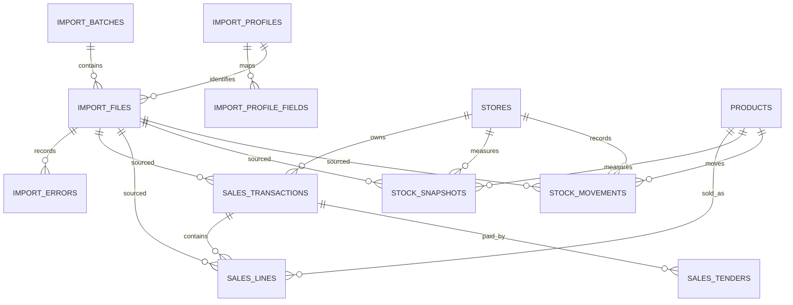

# SQL Server Express Canonical Schema

## Design principles

- Canonical facts are separate from raw source metadata and staging data.
- Every fact retains batch, file and source-row lineage.
- Monetary values use `decimal(19,4)`; quantities use `decimal(19,4)` unless real samples prove integer-only semantics.
- Business dates use `date`; import timestamps use `datetime2(3)` in UTC.
- Natural source identifiers are retained, while surrogate `bigint` keys support stable joins.
- Mappings and business rules are versioned/effective-dated.

## Foundation tables

### `schema_migrations`

`migration_id varchar(100)` primary key, `checksum char(64)`, `applied_utc datetime2(3)`.

### `stores`

`store_id int identity` primary key; unique `store_code varchar(30)`; `store_name nvarchar(200)`; nullable `business_unit_id`; `is_active bit`.

### `business_units`

`business_unit_id int identity` primary key; unique `business_unit_code varchar(30)`; name and active flag.

### `brands`, `categories`, `subcategories`, `collections`

Surrogate integer key, unique controlled code, display name, active flag. Child tables carry the appropriate foreign key only when the hierarchy is confirmed by source/master data.

### `products`

`product_id bigint identity` primary key; unique `product_code nvarchar(100)`; description; nullable brand/category/subcategory/collection foreign keys; active flag; created/updated timestamps.

### `staff`

Optional reporting dimension: surrogate key, controlled staff code, display name, store association and active dates. Do not populate from unapproved free-text names.

### `transaction_types`

Controlled code and classification (`Sale`, `Return`, `TransferIn`, `TransferOut`, `Adjustment`, etc.), sales sign, stock sign and effective dates. Sign semantics require business approval.

## Import and lineage

### `import_profiles`

Profile ID/version, report type/code, layout version, sheet matcher, header-row strategy, normalized header-signature hash, active/effective dates and source provenance.

Unique constraint: `(report_code, layout_version, profile_version)`.

### `import_profile_fields`

Profile FK, canonical field, source header, datatype, required flag, transform code, default value and ignored flag. Unique `(import_profile_id, canonical_field)` and `(import_profile_id, normalized_source_header)` where applicable.

### `import_batches`

Batch ID, status, started/completed timestamps, initiating user, store/period, profile set version, row counts and control totals.

### `import_files`

File ID, batch FK, original name, SHA-256, size, report code, profile FK, sheet, source period, row count and status.

Duplicate candidate unique index: `(sha256, report_code, store_id, period_start, period_end)` after semantics are confirmed.

### `import_errors`

Batch/file FK, optional source row/column, severity (`Blocker`, `Warning`, `Information`), stable code and safe message. Raw customer data must not be copied into messages unnecessarily.

### Staging

Use profile-specific typed staging tables or bulk-load table types for the first vertical slice. Staging rows include `import_file_id` and `source_row_number` and are deleted/archived by a defined retention policy. Do not create one permanent production table per workbook.

## Sales facts

### `sales_transactions`

`sales_transaction_id bigint identity` primary key; store FK; `transaction_date date`; source transaction/invoice number; transaction-type FK; optional staff FK; batch/file/source-row lineage; gross, discount, tax and net totals; currency code.

Candidate unique key must be derived from real ETP identifiers. Until approved, detect potential duplicates and block ambiguous re-import rather than inventing a key.

### `sales_lines`

Line ID; transaction FK; optional source line number; product FK; quantity; gross, scheme discount, user discount, tax and net amounts; batch/file/source-row lineage.

Indexes initially target `(transaction_date, store_id)`, transaction FK, product FK and lineage FKs.

### `sales_tenders`

Transaction FK, controlled tender type, amount and lineage. This normalizes R022 payment measures instead of adding one column per future tender type.

## Stock facts

### `stock_snapshots`

Snapshot ID; store/product/location; snapshot date/type (`Opening`, `Closing`, other approved); quantity; value; batch/file/source-row lineage. Unique candidate `(store_id, product_id, stock_location_id, snapshot_date, snapshot_type, import_file_id, source_row_number)`.

### `stock_movements`

Movement ID; store/product/location; movement date; transaction-type FK; signed quantity/value; source document identity; optional linked sale line; lineage.

Stock closing is calculated from approved snapshots and movements, not stored as an unexplained mutable total.

## Reporting configuration

### `business_rule_versions`

Stable rule code, version, effective dates, status, human-readable definition and implementation checksum/reference.

### `report_definitions`

Stable report ID/name, version, purpose, parameter schema, result schema and active flag. Executable SQL/application code remains version-controlled; the table identifies the active approved definition rather than storing arbitrary SQL entered by users.

## Relationships

Final nullability, unique keys, hierarchy and signs remain subject to real ETP samples and approved business definitions.
