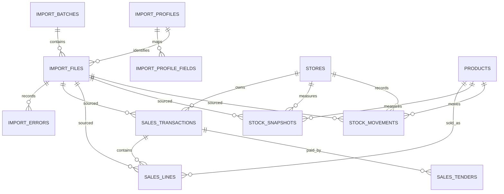

# SQL Server Express Canonical Schema

## Design principles

- Canonical facts are separate from raw source metadata and staging data.
- Every fact retains batch, file and source-row lineage.
- Monetary values use `decimal(19,4)`; quantities use `decimal(19,4)` unless real samples prove integer-only semantics.
- Business dates use `date`; import timestamps use `datetime2(3)` in UTC.
- Natural source identifiers are retained, while surrogate `bigint` keys support stable joins.
- Mappings and business rules are versioned/effective-dated.

## Foundation tables

### `schema_migrations`

`migration_id varchar(100)` primary key, `checksum char(64)`, `applied_utc datetime2(3)`.

### `stores`

`store_id int identity` primary key; unique `store_code varchar(30)`; `store_name nvarchar(200)`; nullable `business_unit_id`; `is_active bit`.

### `business_units`

`business_unit_id int identity` primary key; unique `business_unit_code varchar(30)`; name and active flag.

### `brands`, `categories`, `subcategories`, `collections`

Surrogate integer key, unique controlled code, display name, active flag. Child tables carry the appropriate foreign key only when the hierarchy is confirmed by source/master data.

### `products`

`product_id bigint identity` primary key; unique `product_code nvarchar(100)`; description; nullable brand/category/subcategory/collection foreign keys; active flag; created/updated timestamps.

### `staff`

Optional reporting dimension: surrogate key, controlled staff code, display name, store association and active dates. Do not populate from unapproved free-text names.

### `transaction_types`

Controlled code and classification (`Sale`, `Return`, `TransferIn`, `TransferOut`, `Adjustment`, etc.), sales sign, stock sign and effective dates. Sign semantics require business approval.

## Import and lineage

### `import_profiles`

Profile ID/version, report type/code, layout version, sheet matcher, header-row strategy, normalized header-signature hash, active/effective dates and source provenance.

Unique constraint: `(report_code, layout_version, profile_version)`.

### `import_profile_fields`

Profile FK, canonical field, source header, datatype, required flag, transform code, default value and ignored flag. Unique `(import_profile_id, canonical_field)` and `(import_profile_id, normalized_source_header)` where applicable.

### `import_batches`

Batch ID, status, started/completed timestamps, initiating user, store/period, profile set version, row counts and control totals.

### `import_files`

File ID, batch FK, original name, SHA-256, size, report code, profile FK, sheet, source period, row count and status.

Duplicate candidate unique index: `(sha256, report_code, store_id, period_start, period_end)` after semantics are confirmed.

### `import_errors`

Batch/file FK, optional source row/column, severity (`Blocker`, `Warning`, `Information`), stable code and safe message. Raw customer data must not be copied into messages unnecessarily.

### Staging

Use profile-specific typed staging tables or bulk-load table types for the first vertical slice. Staging rows include `import_file_id` and `source_row_number` and are deleted/archived by a defined retention policy. Do not create one permanent production table per workbook.

## Sales facts

### `sales_transactions`

`sales_transaction_id bigint identity` primary key; store FK; `transaction_date date`; source transaction/invoice number; transaction-type FK; optional staff FK; batch/file/source-row lineage; gross, discount, tax and net totals; currency code.

Candidate unique key must be derived from real ETP identifiers. Until approved, detect potential duplicates and block ambiguous re-import rather than inventing a key.

### `sales_lines`

Line ID; transaction FK; optional source line number; product FK; quantity; gross, scheme discount, user discount, tax and net amounts; batch/file/source-row lineage.

Indexes initially target `(transaction_date, store_id)`, transaction FK, product FK and lineage FKs.

### `sales_tenders`

Transaction FK, controlled tender type, amount and lineage. This normalizes R022 payment measures instead of adding one column per future tender type.

## Stock facts

### `stock_snapshots`

Snapshot ID; store/product/location; snapshot date/type (`Opening`, `Closing`, other approved); quantity; value; batch/file/source-row lineage. Unique candidate `(store_id, product_id, stock_location_id, snapshot_date, snapshot_type, import_file_id, source_row_number)`.

### `stock_movements`

Movement ID; store/product/location; movement date; transaction-type FK; signed quantity/value; source document identity; optional linked sale line; lineage.

Stock closing is calculated from approved snapshots and movements, not stored as an unexplained mutable total.

## Reporting configuration

### `business_rule_versions`

Stable rule code, version, effective dates, status, human-readable definition and implementation checksum/reference.

### `report_definitions`

Stable report ID/name, version, purpose, parameter schema, result schema and active flag. Executable SQL/application code remains version-controlled; the table identifies the active approved definition rather than storing arbitrary SQL entered by users.

## Relationships

```mermaid
erDiagram
  IMPORT_BATCHES ||--o{ IMPORT_FILES : contains
  IMPORT_FILES ||--o{ IMPORT_ERRORS : records
  IMPORT_PROFILES ||--o{ IMPORT_PROFILE_FIELDS : maps
  IMPORT_PROFILES ||--o{ IMPORT_FILES : identifies
  STORES ||--o{ SALES_TRANSACTIONS : owns
  SALES_TRANSACTIONS ||--o{ SALES_LINES : contains
  SALES_TRANSACTIONS ||--o{ SALES_TENDERS : paid_by
  PRODUCTS ||--o{ SALES_LINES : sold_as
  STORES ||--o{ STOCK_SNAPSHOTS : measures
  PRODUCTS ||--o{ STOCK_SNAPSHOTS : measures
  STORES ||--o{ STOCK_MOVEMENTS : records
  PRODUCTS ||--o{ STOCK_MOVEMENTS : moves
  IMPORT_FILES ||--o{ SALES_TRANSACTIONS : sourced
  IMPORT_FILES ||--o{ SALES_LINES : sourced
  IMPORT_FILES ||--o{ STOCK_SNAPSHOTS : sourced
  IMPORT_FILES ||--o{ STOCK_MOVEMENTS : sourced
```

Final nullability, unique keys, hierarchy and signs remain subject to real ETP samples and approved business definitions.

## Phase 5 accounting additions — 17 September 2026

Migration 0029 adds nullable `accounting_batches.approval_reason nvarchar(1000)`; historical reasons are not fabricated. Approval persists the supplied reason with its status/actor/time. Mapping request, decision and replacement run in one transaction.

Migration 0030 adds `rejection_reason nvarchar(1000)`, `rejected_by nvarchar(200)` and `rejected_utc datetime2`, plus Owner-only `dbo.reject_accounting_batch`. Rejection and audit are atomic; DRAFT/REVIEW/APPROVED are eligible, EXPORTED/REJECTED are not. The original approval fields remain intact. The planned status renaming and invoice/export-receipt tables are still pending.

## Phase 7 Tally foundation — migration 0038

Additive only: no existing status value, constraint, index or trigger changes. Every new table is Owner-only (DENY to `etp_store_manager` and `etp_viewer`). THROW numbers 51570–51579; see `docs/audit/PHASE-7-REPORT.md`.

| Table | Purpose |
|---|---|
| `tally_profiles` | One Tally company: name, TEST/PRODUCTION, loopback-only endpoint, and the D13/D14/D16/D17 policy columns. CHECKs refuse a remote endpoint, named customer ledgers with tender inside the voucher, a single-ledger policy without its ledger, and live books enabled without who enabled them. |
| `tally_profile_stores` | Which stores a profile covers; a store binds to at most one TEST and one PRODUCTION company. |
| `accounting_vouchers` | One planned Tally voucher; its `correspondence_key` must equal `ETP:{store}:{invoice_year}:{document_number}:{component_role}:{revision}`. A number containing `:`, `|` or white space can be stored only as BLOCKED/EXCLUDED. Immutable once the batch leaves DRAFT/BLOCKED, except `voucher_status`/`blocked_reason`. |
| `accounting_voucher_reservations` | One active reservation per (profile, store, year, document number, role, revision). Never deleted; released once, automatically when a batch is rejected or a voucher is blocked/excluded before any attempt. |
| `accounting_status_history` | Append-only; one row per batch or voucher status change, written by trigger. Existing batches get one starting row at upgrade. |
| `tally_artifacts` | Append-only register of evidence files (kind, relative path, SHA-256, length). |
| `tally_attempts` | One file write or send; may only advance its outcome from RECORDED or SENT; never deleted. |

`accounting_batches` gains `tally_profile_id`, `batch_kind` (`DAY_JOURNAL` for every existing row, or `SALES_VOUCHERS`, which needs a profile), `selection_json`, `selection_version`, `mapping_version_set_json` and `manifest_sha256`. `accounting_entries` gains `accounting_voucher_id` (same batch as the voucher), `tax_rate`, `quantity` and `stock_item`. `product_settings` gains `tally_evidence_root`.

## Phase 7 findings, read-backs and reconciliation — migration 0039

Additive and Owner-only, like 0038.

| Table | Purpose |
|---|---|
| `accounting_validation_findings` | WARN and FAIL results of the validation rules for a batch or one of its vouchers. Never deleted; a WARN can be accepted once, with who, when and why. |
| `tally_readbacks` | One read-back: Tally company as Tally reported it (never filled in from the request), date range, voucher count, complete or the reason it is not, and the stored file. Append-only. |
| `tally_actual_vouchers`, `tally_actual_ledger_entries` | What the read-back says Tally holds, field by field. Fields Tally did not return stay NULL. Append-only. |
| `tally_reconciliation_runs` | One comparison of a batch with a read-back, its outcome, a summary and its evidence file. Append-only; a later run never changes an earlier one. |
| `tally_reconciliation_differences` | One row per failed or warning check, with values A/B/C, delta, rule, rationale and the fixed required action. Never deleted; a WARN can be accepted once. |

## Phase 7 review fixes — migration 0040

No new tables. The finding and difference guards no longer treat an UPDATE that changed no row as a delete. A voucher of a decided batch can no longer go back to PLANNED, BLOCKED or EXCLUDED, and a BLOCKED or EXCLUDED one stays so (51212). `tally_readbacks.incomplete_reason` also allows `PERIOD_MISMATCH`: the file's own period does not contain the dates entered for it.

## Service Centre interim — migration 0048

`0048_service_centre_interim.sql` (Service review step S-2, decisions 15 and 16, 3-4 Oct 2026; release 1.9.5). Additive and idempotent, in one transaction; it must apply after 1.9.4's 0046/0047. 0049 is reserved for the Tally cost-centre migration of GitHub PR #3 (renumbered from its 0041, decision 18), and 1.10.0 numbers its own migrations from 0050 (below). The design is `SERVICE-INTERIM-DESIGN.md` (`Reference\Work in progress 2026-10-03\service\`). The script has three sections, each with one owner, in this order:

**A_SERVICE_STORE.** `business_units` row `SERVICE` ("Service Centre"); `stores` row `AW330` ("Service Centre AW330") with that business unit and `is_active = 0`, inserted only when missing (an existing AW330 row is never updated). Trigger `trg_stores_service_unit_inactive` (AFTER INSERT, UPDATE on `dbo.stores`) THROWs 51900 when a SERVICE-unit store is made active, and 51904 when a SERVICE-unit store is moved out of the SERVICE business unit (`business_unit_id` changed or set to NULL). Settings > Stores explains both refusals in plain words. AW330 stays inactive because an active store would need an R025 import for the combined Retail date, get its own daily pack and join the DSR and evening store lists. Retail stores keep a NULL business unit. `import_files.store_code` has no foreign key, so Service files need no other store change; there is no `daily_reporting_days` row for AW330, so the landing triggers' day lock never applies to Service (no Service day locking).

**B_SERVICE_LANDING.** Generated from the catalogue by `scripts/service-centre/generate_landing_sql.py`; never edit it by hand. 36 tables `dbo.etp_landing_snnn` (35 consolidated families plus S041 GPRC CLAIM) in the 0018 shape: `etp_row_id bigint IDENTITY` primary key, `import_file_id` (FK `import_files`), `source_lineage_id` (unique, FK `source_lineage`), `content_key varchar(80)`, then one column per catalogue column (Text and Identifier `nvarchar(max)`, Decimal `decimal(19,4)`, Date `date`, Integer `int`), with the canonical names the catalogue holds. The generator reads `src/Etp.Reporting.Import/Profiles/EtpReportFamilies.json` (the S entries), not the spec; `scripts/service-centre/families.spec.json` is the frozen origin of those names, which the catalogue copies, and `ServiceLandingMigrationTests` compares this section with the catalogue. Each table has `IX_etp_landing_snnn_file`, the 0018 locked-day trigger and `append_etp_landing_snnn` with the 0025 guards (role 51420; transaction, file and report-code checks 51422, `report_code = 'Snnn'`), which also writes `dbo.etp_import_content`. DENY INSERT, UPDATE, DELETE to `etp_store_manager` and `etp_viewer`; GRANT EXECUTE on the procedure to `etp_store_manager` and `etp_owner`. `promote_import_superset` needs no Service block: its content-key check covers untyped families.

Every Service file is one dated snapshot ("reading"): `import_files.period_end` is the folder date of a consolidated workbook or the window end in a raw export's name. Rows are never updated or deleted; a new refresh adds a new reading beside the old ones.

| Table | Family | Read rule |
|---|---|---|
| `etp_landing_s002` | Job report (booking) | job list |
| `etp_landing_s003` | Revenue report | date log (Trans Date) |
| `etp_landing_s004` | Tender collection (detailed) | date log (BillingDate) |
| `etp_landing_s006` | Closing stock (spares) | state snapshot |
| `etp_landing_s007`, `etp_landing_s008` | Purchase register, created / received | date log (GRN_DATE) |
| `etp_landing_s009` | Pending repair | state snapshot |
| `etp_landing_s010` | Pending delivery | state snapshot |
| `etp_landing_s011` | SRN status report | job list |
| `etp_landing_s012` | SRN history | job list |
| `etp_landing_s013` | Goods in transit | date log (STM Date) |
| `etp_landing_s014` to `etp_landing_s018` | Repair register DC, IR, RA, RWR, DELIVERED | job list |
| `etp_landing_s019` | Repeat return | date log (RepairDate) |
| `etp_landing_s020`, `etp_landing_s021` | Replacement, depreciation | job list |
| `etp_landing_s022` | Empowerment report | date log (INVOICE DATE) |
| `etp_landing_s023` to `etp_landing_s026` | GPRC, MB, WDC, WRA claims (old format) | date log (TransDate) |
| `etp_landing_s029` | Deftran report | date log (Repair Date) |
| `etp_landing_s030` | MIS export grid | job list |
| `etp_landing_s031` to `etp_landing_s035` | Repair register PD, PR, SRN, REPAIRED, SRNINV | job list |
| `etp_landing_s036`, `etp_landing_s037` | Delivery report, repair report | job list |
| `etp_landing_s039`, `etp_landing_s040` | WD claim, WRA claim | date log (Transaction Date) |
| `etp_landing_s041` | GPRC CLAIM (raw export, decision 16 Q6; no consolidated workbook) | date log (date part of Transaction Date) |

No table exists for S001 (derived), S005 and S038 (not needed) or S027 and S028 (deferred to the full Service import, P8).

**C_SERVICE_READ.** Read-only views; each has GRANT SELECT to `etp_viewer`, `etp_store_manager` and `etp_owner`, and none exposes a customer phone, e-mail or address column. They read only live Service files (`is_superseded = 0`, `data_truth_version = 1`) and choose rows by each family's read rule, never by import order:

- *state snapshot* (S006, S009, S010): the rows of the reading with the latest snapshot date;
- *date log*: for each business date, the rows of the latest reading whose window (earliest row date to snapshot date) contains that date, so a 4-day raw export replaces only its 4 days and a restated row replaces its old version;
- *job list*: per family and job, the rows of the latest reading that holds the job.

Helper views `v_service_families` (read rule, date column, list label and lifecycle rank per importable family), `v_service_reading_windows` (each live reading's window), `v_service_datelog_readings` (the date-log ranking: reading_rank 1 wins a date), `v_service_status_view_rows` (line rows of the ten status lists) feed the views below.

| View | What it holds |
|---|---|
| `v_service_readings` | One row per Service import file: report code, snapshot date, window start, import file, rows, import time, source kind (CONSOLIDATED or RAW) and `is_latest` per family. The refresh log, and the base of the growth check. |
| `v_service_job_readings` | Job, report code, snapshot date, import file and status date for every job list and for S009/S010. The base of the next three views. |
| `v_service_job_status_current` | One row per job: the current status (the status list whose winning reading is latest, ties broken by the lifecycle rank), money summed over the line rows (spare value, labour), line count and how many other lists held the job. |
| `v_service_pending_current` | Pending repair (S009) and pending delivery (S010) from the latest snapshot with age in days, plus SRN status (S011). Amended by 0050 (below): open SRNs only, plus EDD, status, spare and indent columns. |
| `v_service_job_list_events` | History of jobs in lists: FirstSeen, Reappeared, LeftList and StillListed, for S009/S010 and for the job lists. Information only; it writes nothing and creates no review item. From 1.10.0 the Job history screen reads `v_service_job_timeline` (0050) instead, because a raw window made every consolidated job look as if it "left" its list (SD-01). |
| `v_service_s004_daily` | S004 tender amount per business date and tender (CASH, CARD, UPI with BharatPe and PhonePe, CHEQUE, RTGS, ADVANCE), from the winning reading. Columns `business_date, tender, amount, row_count, snapshot_date, import_file_id`. |
| `v_service_money_changes` | For S003 and S004, each business date whose total differs between the winning reading and the previous covering reading (or the reading it restated), with both snapshots and amounts. |
| `v_service_gprc_claims` | GPRC claim lines from S023 (consolidated history, up to 5 Aug 2026) and S041 (raw GPRC CLAIM, from 1 Aug 2026), each first chosen by its own date-log rule. S041 wins per claim document: an S023 line is kept only when no winning S041 line has the same document number (an S023 line with no document number only on a date with no S041 line), so the 1-5 Aug overlap is counted once. No customer column. |
| `v_service_manual_money` | The manual `SERVICE_*` entries of `dbo.manual_operational_inputs` per shop, date and field, with the tender (CASH, CARD, UPI; NULL for `SERVICE_WDC`) and `is_service_money_shop`, which marks the Titan World shop (WLMHW) where all of the Service centre's money is entered (decision 16, Q1). The store code is written in this view, not in C#. |

`SqlServerServiceReportQuery` reads these views for the four Service screens. The money check (decision 16, rules in `ServiceMoneyCheck`) compares S004 CASH, CARD and UPI with the Titan World shop's `SERVICE_CASH`, `SERVICE_CARD` and `SERVICE_UPI` entries by bill date and per tender, and shows the difference (S004 minus manual); nothing is corrected. Entries at any other shop are returned apart, for the "Service entries at other shops (not added)" grid, and never summed. `SERVICE_WDC` is not compared, and no advance is deducted (advances are 0; a non-zero S004 ADVANCE, CHEQUE or RTGS amount is shown without a manual side).

SQL error numbers 51900–51929 are the Service block (`docs/service-centre/SERVICE-INTERIM-NUMBERS.md`); 0048 uses 51900 and 51904 only. Storage: about 35k landing rows per weekly consolidated reading plus small daily raw readings; measure it with `scripts/service-centre/measure-service-growth.sql` (`docs/OPERATIONS.md`).

## Service Centre UI — migration 0050

`0050_service_centre_ui.sql` (Service Centre UI wave, decision 25, 10 Oct 2026; release 1.10.0; lane sql of the 1.10.0 wave). Design: `docs/roadmap/SERVICE-CENTRE-UI-DESIGN-REVIEW-2026-10-10.md`, sections 3, 4 and 6. It follows 0049, which is the Tally cost-centre migration of GitHub PR #3. Until 0049 is on the same branch, `MigrationTests` reports a gap in the numbers; that is expected, as it was for 0048 in 1.9.4. 0048 is never edited: its text is checksummed.

**Written from the sql lane's branch (`svcui/sql` at 7d91a57) and checked against the merged 0050 on `release/1.10.0` (10 Oct 2026; the one later change, the S026/WDC rule under `v_service_claims`, is included).** The design names the file `0050_service_job_model.sql`; the lane named it `0050_service_centre_ui.sql`.

**What it is.** One section, `D_SERVICE_UI_READ` (owner: lane sql). It runs in the migration runner's single transaction (`SET XACT_ABORT ON`, no BEGIN or COMMIT). Every view is `CREATE OR ALTER` through `EXEC(N'…')`, followed by its grants, so running it again changes nothing. It writes no data and adds no table, procedure, trigger or index.

**Rules every 0050 view keeps:**

- **Columns by name, never `SELECT *`.** No view exposes a phone, e-mail or address column (design 1.8: `mobilenumber`, `email`, `endcustomercontactnumber`, `customermobile`, `customeremail`, `landline_no`, `mobile_no`). The customer name appears only in `v_service_status_view_facts` and `v_service_job` (the Job history header and Jobs list show it, as the 0048 views did); the Pending board and the claim, parts and timeline views carry none.
- **The 0048 read rules still decide which reading counts:**
  - job list: per family and job, the latest reading that holds the job;
  - state snapshot (S006, S009, S010): the latest reading, where a reading with rows beats an empty one on the same date;
  - date log: per business date, the latest reading whose window covers the date.

  A raw window therefore never hides consolidated history, and the import order never matters.
- **The job key** is the exported job order number, trimmed (`NULLIF(LTRIM(RTRIM(CONVERT(nvarchar(100), <column>))), N'')`), never padded or re-formatted (decision 25 Q1; design 1.3 shows 100 % join rates and no collision between the 15- and 16-character forms).

**Grants.** Each view has `GRANT SELECT` to `etp_viewer`, `etp_store_manager` and `etp_owner`, and `DENY INSERT, UPDATE, DELETE` to `etp_store_manager` and `etp_viewer`, as 0048 section C does.

| View | One row per | What it holds |
|---|---|---|
| `v_service_status_view_facts` | line row of the ten status lists (S014-S018, S031-S035), every reading | The lifecycle columns that `v_service_status_view_rows` (0048) does not carry: job date, EDD, brand, model (variant number), product category (cluster id), customer name, guarantee, customer type, indent date and number, SRN issued/returned/received dates and to-store code, repair date, delivery date, RWR date and reason, WDC date and number, WRA date and RA DC number, repair status, spare value, labour charge. It is the base of `v_service_job` and `v_service_job_timeline`. |
| `v_service_claims` | claim line | Every claim to Titan in one shape. Columns: `claim_type` (GPRC, MB, WDC, WRA), `report_code`, `business_date`, `document_number`, `job_order_number`, `item_id`, `quantity`, `account_number`, `net_amount_inc_tax`, `ucp_value`, `snapshot_date`, `import_file_id`. Sources by type: • GPRC: from `v_service_gprc_claims` (S023 + S041, S041 wins per document). • MB: S024. • WDC: S039 (new header) + S025 (old header). • WRA: S040 + S026. Each family's rows are first chosen by its own date-log rule. The new-header family then wins per document number: an old-header line is kept only when no new-header line has the same document number, and an old-header line without a document number only on a date that has no new-header line. So the 1 Jul 2026 join of S025/S039 and S026/S040 is counted once (decision 25 Q12). An old WRA line (S026) whose document number is a WDC document (S025 or S039) counts only as WDC (Sagar, 10 Oct 2026: 28 such lines on live, none with a job number). No settlement column exists in any export (Q9 = raised only). |
| `v_service_job` | Service job | The job model (design 4.1-4.4). See the column list below. |
| `v_service_job_timeline` | (job, reading, family, event date, status, store, document) | Job history: every live reading of every family that holds the job (job lists S002, S036, S037; the ten status lists S014-S018 and S031-S035; S009, S010, S011, S012; S003 revenue; S019 repeat return, S020 replacement, S021 depreciation, S022 empowerment; S029 Deftran; S030 running tests; claims S023-S026 and S039-S041). Columns: `job_order_number`, `snapshot_date`, `source_kind` (CONSOLIDATED/RAW), `report_code`, `list_label` (S036 "Delivery-type jobs", S037 "Repair-type jobs", Q10; others from `v_service_families`), `event_date` (the family's own date: WDC date, indent date, WRA date, RWR date, delivery date, repair date, SRN date, transaction date, test date and so on), `status_text` as exported, `pending_store`, `document_number` (indent, DC, SRN, claim or revenue document), `amount` (summed over the lines), `lines`, `import_file_id`. It replaces `v_service_job_list_events` on the Job history screen (SD-01). The 0048 view stays, unchanged, for the S009/S010 list history. |
| `v_service_parts` | purchase invoice line (invoice number, item) | S007 (created) full-joined to S008 (received). S008 follows the date-log rule on `grn_date`. S007 rows come from the latest reading that holds the invoice: an open invoice has no GRN date, so the date-log rule cannot choose it. Columns: `invoice_number`, `invoice_date`, `item_id`, `shipped_quantity`, `received_quantity`, `net_amount`, `grn_number`, `grn_date`, `received_date`, `status`, `exported_status`, `from_location`, `days_open`, `snapshot_date`, `as_at`. `status` is `Received` when an S008 line exists or the S007 row has a GRN date, else `Open`. `days_open` counts invoice date to GRN date (received) or to `as_at` (open). No job column exists on either family (design 1.7). |
| `v_service_parts_transit` | goods-in-transit line (S013) | Date-log rule on `stm_date`. Columns: `stm_number`, `business_date`, `item_id`, `quantity_shipped`, `from_location`, `to_location`, `ucp`, `snapshot_date`, `import_file_id`. No job column. |
| `v_service_stock_summary` | latest S006 reading | Columns: `snapshot_date`, `items`, `quantity`, `value` (quantity × price), `import_file_id`. Count and value only; no item rows. |
| `v_service_pending_current` (amended) | list row, as in 0048 | `CREATE OR ALTER` of the 0048 view (SD-02, SD-12, decision 25 Q5). • The 0048 columns keep their names and order: `list`, `report_code`, `list_label`, `job_order_number`, `job_date`, `age_days`, `brand`, `model`, `customer_name`, `pending_store`, `snapshot_date`, `import_file_id`. • New columns follow them: `edd`, `jo_status`, `spare_required`, `indent_date`, `repair_date`, `srn_to_status`. • S009 and S010 are still the latest state snapshot. • S011 keeps the job-list rule but lists **open SRNs only**. An SRN is closed when `srn_received_date` is set, or `repaired_date` is set, or `to_status` contains "Received". On the 9 Oct data this gives 10 open SRNs where 0048 listed 141. |

**`v_service_job` columns:**

- **Identity and booking:**
  - `job_order_number`;
  - `booking_date`: the least of S002/S036/S037 `created_date`, status-list `jodate`, S009/S010 `jodate`, S011 `joborder_date` and S029 `srf_date`;
  - `jo_type`: S002 `jotype_booking_quickbilling` as exported, or `Booking` when the job has no S002 row (Q2);
  - `exported_status`: S002 `current_status`, which is shown but never used for the stage.
- **Descriptive** (taken from the status lists, then S009/S010, then the job lists, then S011, then S029): `brand`, `model`, `product_category`, `customer_name`, `guarantee`, `customer_type`. `edd` is S009's EDD, else the status lists'.
- **Stage:** `stage`, `stage_date` and `pending_at` (where the watch is, by default AW330), set by the rule below.
- **Lifecycle dates and documents:**
  - `spare_required` (S009), `indent_date`, `srn_date`, `srn_to_store`;
  - `repair_date`, `delivery_date`, `rwr_date`, `rwr_reason`;
  - `wdc_date`, `wdc_number`, `wra_date`, `radc_number`.
- **`claim_raised`** (bit): a WDC claim document exists for a DC job, or a WRA one for an RA job, in any live claim reading.
- **Money:**
  - `spare_value` and `labour_charge`: the line rows of the job's current status list, chosen by latest reading, then lifecycle rank (as `v_service_job_status_current`);
  - `revenue_labour_charge`, `revenue_spare_charge`, `revenue_net_incl_tax` and `revenue_documents`: the winning S003 lines (date-log rule).
- **Time:**
  - `tat_days`: booking to delivered, or booking to RWR, for closed jobs;
  - `tat_repair_days`: booking to repaired, for delivered jobs;
  - `age_days`: booking to `as_at`, open stages only;
  - `days_in_stage`: `stage_date` to `as_at`, open stages only;
  - `is_overdue`: EDD before `as_at`, never for DELIVERED, RWR or a DC/RA job closed by its claim. The per-stage limits for jobs without an EDD (7/15/30/15/7) are applied in C#, in `ServiceAgeing.OverdueBy`.
- **`is_open`** (bit): 0 for DELIVERED and RWR, and for a DC/RA job whose claim is raised ("closed by claim", Q3); 1 otherwise.
- **Readings:** `last_reading_date` is the latest snapshot date of any list that holds the job. `as_at` is the latest snapshot date of any live Service reading.

**The stage rule** (design 4.2, decision 25 Q3 and Q5). The first rule that fires gives the stage:

1. `DELIVERED`: in S018, or S029 status Delivered with a delivered date.
2. `RWR`: in S017, or S029 RWR.
3. `DC_ISSUED`: in S014.
4. `RA_ISSUED`: in S016.
5. `IN_TRANSIT_BACK`: the latest S010 holds the job at a `pendingstore` other than AW330.
6. `READY_FOR_DELIVERY`: the latest S010 holds it at AW330, or it is in S031/S034.
7. When the latest S009 holds the job, S009 decides, because it is fresher than the cumulative status lists:
   - `jostatus` SRN* gives `SRN_OUT`;
   - `Indent_Raised`, an `indentid` or an `indentdate` gives `INDENT_RAISED`;
   - anything else gives `ON_BENCH`.
8. `SRN_OUT`: an open S011 SRN by the Q5 rule, or the job is in S033/S035 and S011 holds no row for it (S033/S035 only say "reached SRN once"; integration 10 Oct 2026, R-SQL-03).
9. `INDENT_RAISED`: in S015.
10. `ON_BENCH`: in S032.
11. A closed S011 SRN (Q5) is evidence too (R-SQL-02): `DC_ISSUED` when its `to_status` contains DC (for example SRN_Returned_without_Repair_DC_Created), otherwise `READY_FOR_DELIVERY`; the stage date is the SRN's received or repaired date.
12. `BOOKED`: anything else (job lists only).

`stage_date` is that stage's own date: delivery, RWR, WDC or WRA date, S010 repair date, PD/REPAIRED repair date, SRN date, indent date, S009 job date, or the booking date.

The design sketch puts S011 before S009. The lane moved the S009 test ahead so that the fresher list wins. Check this order at merge against `ServiceJobModelSqlTests` (one fixture job per stage).

S036 and S037 are job lists whose `created_date` is the booking date (Q10). They give job keys and the booking date only, never a delivery or repair date (SD-04).

**Performance (SD-11).** `v_service_job` is one `UNION ALL` + `GROUP BY` over the landing tables. It states the live-reading filter of `v_service_reading_windows` itself (not superseded, truth version 1, Completed batch, an importable Service family, a snapshot date) and applies the three read rules directly, because a first version that referred to the 0048 reading views a dozen times took minutes. The lane measured about **2.5 s on live** (28k landing rows); the screens' target is about 1 s. The acceptance runbook (`docs/roadmap/SERVICE-UI-1.10.0-ACCEPTANCE.md`) times every screen on a staging copy with three more weekly readings. If a screen stays over about 1 s, the design's next step is migration 0052, `service_job_index`: a table filled by `refresh_service_job_index` after each Service batch, which `v_service_job` then reads. 0050 creates no index or table.

**Not in 0050** (design 4.5):

- 0051 `service_claim_settlements` (only if Q9 had been B; decision 25 chose A, raised only);
- 0052 `service_job_index` (only if measured slow);
- the optional `stores.is_service_money_shop` flag (SD-07). `v_service_manual_money` keeps the WLMHW literal; decision 16 is unchanged.

**Read contract.** `SqlServerServiceReportQuery` (partial file `SqlServerServiceReportQuery.Ui.cs`) reads these views for the 1.10.0 `IServiceReportQuery` members: `LoadTodayAsync`, `LoadPendingBoardAsync`, `LoadJobAsync`, `LoadJobListAsync`, `LoadClaimsAsync`, `LoadPartsAsync` and `LoadFreshnessAsync`. The records are in `src/Etp.Reporting.Application/Service/ServiceUiContracts.cs`, and the pure rules (bands, overdue, TAT median, board, Today, freshness) are in `ServiceUiRules.cs`. The freshness strip has no SQL of its own: it groups `v_service_readings` in C#.
