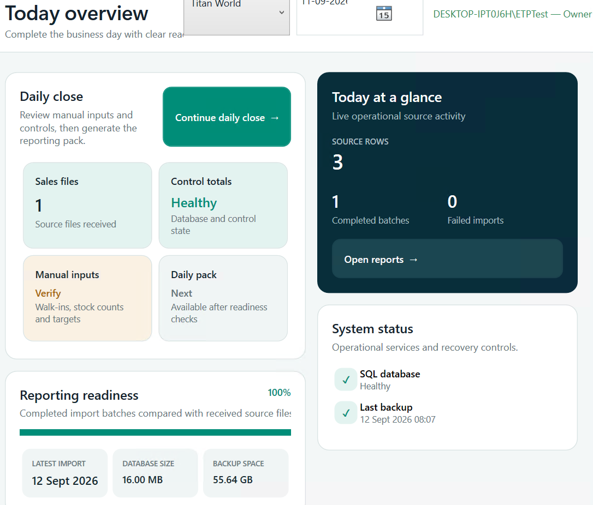

# ETP Reporting Engine — Complete UI Redesign Sprint

**Plan date:** 12 September 2026

**Plan version:** 1.0

**Status at plan creation:** PLANNED. This is the preserved requirements contract; current implementation and blocked acceptance status are recorded in the [current session handoff](../audit/ETP-SESSION-HANDOFF-2026-09-13-UI-REDESIGN.md) and execution ledger.

**Scope:** One continuous sprint, in exactly four phases, covering the complete active Windows application.

**Execution owner:** Codex, using the decisions and acceptance criteria below.

**Purpose:** Record what we decided, guide implementation without repeated design questions, and make completion independently checkable.

**Resume implementation:** Read the [session handoff](../audit/ETP-SESSION-HANDOFF-2026-09-13-UI-REDESIGN.md), [execution ledger](ETP-UI-REDESIGN-SPRINT-LEDGER.md) and [decisions register](ETP-UI-REDESIGN-DECISIONS.md). All phase tasks are initially NOT STARTED; this document records planned requirements, not achieved results.

## 1. Outcome we are committing to

Make ETP easy to understand and operate on desktop and tablet screens. Keep the existing colour scheme and the useful grouping demonstrated by Today Overview. Apply that organisation consistently throughout the application: an understandable module, a small set of categories, then a focused task or report.

The user should see the important information and next action on the current screen, find any authorised destination through one persistent search, and move between tasks without hunting through a long page. A menu entry must open the requested task, not merely open a large workspace containing that task somewhere below.

This is a structural redesign of the existing WPF application. Completion means converting every active area and verifying complete workflows. Four attractive demonstration screens alone do not complete this sprint.

### User decisions already established

- Keep the existing colour scheme.
- Use the categorised groups and nested tiles in Today Overview as the visual reference.
- Prioritise desktop and tablet use, with mouse, keyboard and touchscreen support. A mobile-phone layout is outside scope.
- Make most operational content available within a single screen; use focused subpages for additional tasks.
- Provide a master search everywhere. Typing `DSR` must show its navigation path and open that exact report when selected.
- Use clear category-to-task navigation, breadcrumbs and Back, taking inspiration from Settings navigation.
- Plan first. Once execution starts, make routine design and engineering decisions autonomously and carry all four phases through in one coordinated sprint.

### Reference to preserve



Preserve the *organisation*: Daily close with related tiles, Today at a glance, Reporting readiness, and System status. Rework their size, spacing and priority to fit the available window. The reference's clipped header and large vertical footprint are problems to correct, not dimensions to copy.

## 2. Baseline and authority

The active product is the .NET 10/WPF application. Source areas are `src/`, `tests-dotnet/`, `database/`, `scripts/` and `installer/`. Existing JavaScript/web prototypes are reference material only.

The current navigation registry defines nine business modules, with Settings, Help and Profile as additional shell destinations. Previous audit inventory records 118 navigation entries: 111 active and seven explicitly deferred. The ownership registry currently identifies 14 workspace destinations and 29 report feature routes. Phase 1 must reconcile these counts with the starting source, including buttons, dialogs and destinations absent from the menus. These counts are coverage baselines, not permission to omit additional existing functionality.

Many current navigation entries point at the same combined workspace. For example, Settings entries share `Admin / Settings`, and import intake, quality and document functions share `Import ETP`. Exact task navigation is therefore a required implementation change, not just a change of labels or styling.

The latest recorded engineering candidate is 1.8.7, built from source commit `093b5ef92378a1496d8ac9298dddb31f9e86b602`. Its acceptance record reports 617 passing automated tests and scoped installed/SQL verification. Interactive UI, physical touch, real Windows role identities and some external integrations remain unverified. Record the actual branch, commit, changes and installed version again when this sprint starts.

Related records:

- [VM acceptance and existing limitations](../audit/ETP-2026-09-12-VM-ACCEPTANCE.md)
- [Previous overall review plan](../audit/ETP-FOUR-PHASE-REVIEW-PLAN-2026-09-11.md)
- [Existing navigation contract](../UIUX_V4_NAVIGATION_CONTRACT.md)
- [Existing design system](../UIUX_V4_DESIGN_SYSTEM.md)
- [Desktop architecture](../../knowledge/01-Architecture/Desktop%20Architecture.md)

This plan supersedes the older UI requirement for a large contextual sidebar as the main way of reaching tasks, wherever that conflicts with focused category/task navigation. It preserves the existing palette, native WPF direction, permissions and financial rules. The previous idea of stopping for user approval after a prototype is replaced by an internal evidence-based gate. Update the implementation documents during the sprint; do not rewrite historical audit results.

## 3. Rules for autonomous execution

1. There are no planned user-input or user-approval checkpoints between the four phases. Once the user starts the sprint, pass each internal gate and proceed automatically.
2. Use the frozen defaults in this document. Resolve naming, spacing, component boundaries and implementation order locally. Record significant decisions with reasons and affected requirements.
3. Do not ask the user to choose between minor visual variants, identify controls in repeated screenshots, supply ordinary test values or manually click through acceptance journeys that automation can perform.
4. Use the existing synthetic fixtures and disposable test databases. Preserve the original VM application database, imported source files and verified backups. Never experiment on production data.
5. Finish every active module. If a design defect is found during rollout, correct the shared component and recheck affected screens before continuing.
6. Keep progress and evidence in the sprint records. A failed test is work to fix and rerun, not a reason to transfer routine debugging to the user.
7. Do not silently reduce scope to meet a time or context limit. Resume from this plan and its ledger after interruptions; do not restart completed work.
8. Authentication, unavailable hardware or a tool that cannot access the actual VM UI cannot be solved by a design decision. Continue all independent work, try supported alternatives, and record the precise remaining block. Never treat a shell/SQL test or off-screen rendering as proof of interactive VM use. If an essential access step truly needs the user, ask only for that step, once, with its concrete reason. No credentials belong in this plan, logs or screenshots.
9. No publishing, production deployment, external email/message sending, purchase or destructive production operation is part of this design sprint. Product flows for sharing and recovery remain in scope and are tested through safe test destinations or disposable data.
10. Normal safeguards inside the product—such as Save/Discard/Stay, approving a restatement or confirming a restore—remain. Automated tests exercise them with test data; these are not sprint review pauses.

“One go” means one complete execution plan without planned handoffs back to the user. It does not mean skipping verification, removing safeguards or declaring inaccessible environments tested.

## 4. Frozen design contract

### 4.1 Information hierarchy

```text
Modules Home
  → Module overview: small groups of related tiles
    → Category: related tasks with purpose and useful status
      → Task: one form, checklist, table or report
        → Record/detail, only when needed
```

- Familiar frequent tasks may have direct shortcuts that skip the category screen.
- Show a compact global rail, a persistent header, breadcrumbs and the focused content area.
- Do not keep the old wide scrolling sidebar beside every category screen. Use a compact section selector or temporary navigation overlay when useful.
- Category selection replaces the content area. It must not only scroll to a section on a giant page.
- Every active task must be reachable in at most three selections from its module overview. Search selection must open the exact task directly.
- A task may appear in multiple useful places, but all aliases must resolve to one canonical route, permission policy and screen implementation.
- Keep location and history distinct: breadcrumbs represent the hierarchy; Back returns to the previous location and restores its context.

### 4.2 Persistent shell and context

- Header: page title/location, master search, active store or business scope, business date, and profile/role access. At smaller widths, move secondary identity details into Profile so titles and date values remain readable.
- Back and a tappable breadcrumb are visible on every non-root page. At constrained widths, keep Back, parent and current page visible; expose earlier breadcrumb levels in an overflow menu.
- Keep the full date, selected scope and current screen identity visible. Avoid overlapping text and cropped account names.
- Use one shared business context. A task-specific override must be explicit, labelled and visible; never silently change either date or store when moving between screens.
- A report supporting combined stores can say `All authorised stores`; an import requiring one store must require a specific store without silently selecting one.
- Unsaved changes must survive ordinary screen navigation through a clear Save/Discard/Stay guard or an explicit draft mechanism. Search must use the same guard.
- Status/progress belongs in a small persistent status area or the task itself. Do not fill the header with long descriptions that push useful content below the fold.

### 4.3 One-screen layout and overflow

**Measure WPF client area in device-independent pixels (DIPs), not screenshot pixels.** Record physical resolution, Windows scale and actual client bounds for every visual test.

| Layout band | Default behaviour | Acceptance expectation |
|---|---|---|
| Wide: client width at least 1280 DIP | Two or three balanced tile columns; optional side-by-side detail | Module and category overview content fits without page scrolling |
| Standard: width 1000–1279 DIP | Two columns; compact shell; secondary filters in a panel | Same complete overview content, or an intentional category split rather than hidden overflow |
| Constrained: width 800–999 DIP | Compact rail/header; one or two columns; full-width focused detail | Essential summary, location and main action remain visible; secondary content is reached through labelled navigation |
| Short window: height 440–599 DIP | Shorter header and summary; details become separate views | No hidden primary action, clipped field label or unusable dialog; bounded content scrolling is allowed |

Target normal working client area: at least 1000 × 600 DIP. Required constrained checks extend to 800 × 440 DIP so display scaling on smaller desktops does not break core tasks. Below that, maintain a sensible minimum window size with an explanatory message if needed; do not claim phone support. This refines the former 960 × 600 assumption by explicitly testing DPI scaling and short windows.

- At the normal target size, module/category landing pages must not require vertical page scrolling. Split overloaded categories into meaningful subcategories.
- On task screens, the title, important status and main action stay visible. Long tables, report previews, histories and documents may scroll within their content region.
- Use one principal vertical scroll region per task. Avoid placing a scrolling grid inside another scrolling page. Temporary menus and independent detail panels may have their own bounded scroll region.
- Normal forms and navigation pages must not need horizontal scrolling. Wide analytical tables may use horizontal scrolling with persistent identifying columns and column controls.
- Do not shrink all text, remove useful labels, show dozens of tiny tiles or clip content to claim a one-screen pass.
- Long forms become focused sections or steps. Preserve entered data when moving between sections.
- Display detailed errors below their field or in a focused results view. Put a concise summary by the main action so problems are not hidden off-screen.

### 4.4 Shared components and visual language

Use the existing theme resources and local vector icons. Consolidate repeated styles instead of adding a new palette or external UI framework.

| Component | Required behaviour |
|---|---|
| Overview group | Clear title, optional short description, related tiles, consistent alignment |
| Navigation tile | Verb or task name, brief purpose, optional real status, complete clickable surface |
| Metric tile | Label, value, unit and relevant period; missing and zero remain distinct |
| Task header | Breadcrumb, title, concise status and one visually dominant next action |
| Task action bar | Main action stays visible; secondary actions are consistently placed |
| Settings category/list | Related labelled options leading to individual settings pages |
| Form section | Visible labels, consistent field widths, inline validation and clear save state |
| Data table | Sorting/filtering, virtualisation, useful empty state, keyboard selection and details action |
| Detail surface | Drawer at wide sizes, focused full-width view at constrained sizes; reliable Back/Close |
| Report viewer | Compact controls, bounded preview, visible period/scope and export actions |
| Status and feedback | Text plus icon/colour; success, warning, error, unavailable and busy have distinct meaning |
| Search results | Title, full path, useful description, keyboard focus and touch selection |

- Reuse the current spacing scale; default inner group spacing 12–16 DIP and between major groups 16–24 DIP. Large empty margins must serve a purpose.
- Default body text 14 DIP or larger; secondary metadata at least 12 DIP. Keep the existing font family and clear title hierarchy.
- Comfortable remains the default: actionable controls at least 48 DIP high, selectable table/list rows at least 46 DIP, and touch targets at least 44 × 44 DIP including hit area.
- Compact is an explicit desktop preference: retain the established 34-DIP actions and 30-DIP rows where appropriate. Always expose an easy return to Comfortable. Do not automatically switch a touchscreen user into Compact to fit the window.
- Every action must work without hover. Icon-only controls need an accessible name and discoverable explanation; important actions use visible text.
- Internal contrast targets: ordinary text at least 4.5:1; large text, essential control boundaries and focus indicators at least 3:1. Test the actual combinations used.
- Keep clear keyboard focus, logical tab order and meaningful automation names. Do not convey status by colour alone.

### 4.5 Master search contract

Search is always available in the shell, independent of the selected module. On constrained windows a persistent, labelled Search control may open the full search surface. It must never disappear into a page that requires scrolling.

**Primary example:** type `DSR` → see `Daily Sales Report` and `Reports → Sales → Daily Sales Report` → select → open the DSR screen with the current authorised scope/date.

- Index all active destinations, report codes/names, settings pages, help topics and safe action destinations locally. No network service is needed for navigation search.
- This sprint indexes navigation and help, not arbitrary business records, customer information or document contents.
- Match acronyms, case-insensitive names, useful aliases and words in the path. Rank exact acronym/name matches first, then prefixes, then token/path matches. Use a stable tie-breaker.
- Seed aliases from current labels and common terms: `DSR`, `daily sales`, `backup`, `restore`, `support package`, `diagnostics`, `walk-ins`, `stock count`, `import`, `duplicates`, `Tally`, `users` and `scheduler`. Review aliases for ambiguity.
- Show one canonical result for aliases of the same task. A result includes title, path and short purpose. Similar names must be distinguishable by path.
- Use the same role and availability policy as navigation. An unauthorised destination must not leak through suggestions, recent items or direct route invocation.
- Deferred features are not enabled search results. Any future-feature explanation belongs in a clearly separate information view.
- `Ctrl+K` opens/focuses search; Up/Down selects; Enter navigates; Escape closes and restores focus. Pointer and touch selection do the same.
- Keep `Ctrl+F` for clearly labelled in-page filtering where applicable; do not confuse it with master navigation search. Preserve existing documented navigation/help shortcuts unless deliberately remapped and documented.
- Search may lead to `Restore`, `Export` or `Share` setup screens; selecting a result must not execute those operations.
- Show useful empty-search suggestions and a clear no-results state. Do not show a blank unexplained panel.
- Target query-to-results p95 at most 250 ms on the test VM for the real local index, including any debounce, measured across at least 50 representative queries after startup. Record first-open latency separately; target at most 1 second.

### 4.6 Meaningful states and trustworthy content

Every applicable screen needs normal, empty, loading, success, validation-error, operational-error, unavailable/restricted, busy and stale-data behaviour. Add dirty/unsaved, locked/finalised and duplicate/conflict states where the workflow requires them.

- A missing source is not a value of zero. `N/A`, unavailable and explicit zero must remain distinct in tiles, tables, reports and exports.
- A completed-import ratio must be labelled as import completion. It must not imply the full daily report is ready when manual inputs or control requirements remain outstanding.
- Tie status to a clear store/period and freshness. Do not leave a previous date's success state after context changes.
- Wrong-date imports must name the workbook date and selected business date with a corrective action. Changing file/date/store must invalidate stale validation before persistence.
- Exact duplicate imports show a friendly no-change outcome. Changed-content overlap, conflict and restatement are separate states with their existing controls.
- Show concise operational errors with a support reference when available. Keep sensitive details out of the ordinary UI and privacy-safe support evidence.

## 5. Complete application coverage map

The following is the planned information architecture. Phase 1 expands it to one row per actual route and action. Reorganising a feature never removes it or grants new authority.

| Area | Planned categories and focused tasks | Specific completion requirement |
|---|---|---|
| Modules Home | Role-aware module tiles, favourites, recent authorised destinations | Every permitted module is discoverable; optional pinned modules still work |
| Today / Dashboard | Daily close, Today at a glance, Performance, Controls, System status | Preserve the reference grouping; clear scope/date; accurate readiness; compact summaries link to details |
| Daily close | Manual inputs → control checks → readiness → generate/finalise → archive; controlled reopen | Current stage and next action visible; unmet prerequisites have direct links; locking and approvals unchanged |
| Manual Entry | Walk-ins, stock counts, targets and every existing manual-input type | Focused forms with Save state; explicit zero; input validation; draft/lock behaviour |
| Reports | Sales, Stock, Staff, Tender/Cash, Service, Exceptions, Management, Report packs | All 29 current report codes open exact report screens; preserve actual catalogue identities while applying sensible category labels |
| Imports | Intake; Quality and history; Documents and OCR; register shortcuts | Separate Import Files, Source Inbox, Bulk History, Watch Folder, duplicate/conflict/quarantine review, failures and history |
| Documents / OCR | Repository, native PDF extraction, OCR review, extraction history | Document list/detail/review are focused tasks; OCR optionality does not block ordinary reporting |
| Registers | Inward, outward, credit note, service receipt, stock transfer, expense, vendor invoice | Each active register opens its own list/editor with source linkage; unavailable courier register stays honestly unavailable |
| Accounting | Prepare batch; mappings/review; validate/reconcile; Tally export; export history | Visible stage and balanced totals; mapping approval and controlled export unchanged |
| Archive / Distribution | Generations, final packs, compare, restatements, re-export, shared reports, source documents | Exact generation selected; visible state; immutable historical outputs preserved |
| Exceptions | Open items, data quality, missing sources, layouts, mapping, import conflicts, tender/stock/staff/OCR/accounting issues | Clear actionable inbox; category filter; focused issue detail and permitted resolution |
| Approvals | Existing restatement, mapping and adjustment approval workflows | Owner role restriction enforced in UI and service; exact item/context visible; no generic long-page landing |
| Settings — General | Display density, preferences, existing general options | Small focused pages; saved preferences survive restart and upgrade |
| Settings — Users & Access | Users, roles and existing access configuration | Permissions preserved; dangerous privilege changes are never implicit |
| Settings — Stores & Masters | Stores, master data, import profiles, KPI catalogue, tender rules, accounting mapping shortcut | Clear list/detail/editor pattern; no giant combined settings form |
| Settings — Database & Recovery | Connection, backups, restore/recovery drill, support package, health diagnostics | A user can reach support-package creation without scrolling through Operations Center |
| Settings — Integrations | Watch folders, OCR, email/sharing, scheduler and existing integrations | Setup/status/test actions separated; optional components clearly labelled |
| System Health and Audit | SQL, backups, scheduler, OCR/integrations, audit trail and existing diagnostics | Compact status overview leading to dedicated details; preserve Owner boundaries |
| Help / Profile / Shell | Help Centre, contextual help, keyboard shortcuts, profile/role information, navigation preferences | Reachable from every screen; instructions and screenshots match the new UI |
| Startup and supporting surfaces | Loading/startup, connection/setup prompts, validation dialogs, error dialogs, confirmations, progress and cancellation | Consistent sizing, focus, labels and recovery actions; no overlooked legacy dialog |

The seven currently unavailable items—category sales, sell-through, stock turn, days of cover, courier register, direct posting and GST assistance—remain deferred with their existing reasons. This sprint organises their visibility; it does not invent their missing business rules or enable them.

### Canonical paths to freeze and test

| Search / intent | Destination path |
|---|---|
| DSR / daily sales | Reports → Sales → Daily Sales Report |
| Import workbook | Imports → Intake → Import Files |
| Already imported / duplicates | Imports → Quality & History → Exact Duplicates |
| Support package / diagnostics package | Settings → Database & Recovery → Support Package |
| Backup | Settings → Database & Recovery → Backups |
| Restore | Settings → Database & Recovery → Restore & Recovery Drill |
| Users | Settings → Users & Access → Users & Roles |
| Walk-ins | Dashboard → Daily Close → Manual Inputs → Walk-ins |
| Tally export | Accounting → Export → Tally Export |
| Compare reports | Archive → Generations → Compare Generations |

The Daily Close tile counts as the Dashboard category; selecting Manual Inputs and then Walk-ins must still satisfy the three-selection limit from the Dashboard overview. Shortcuts can reduce that distance.

## 6. The four implementation phases

All four phases belong to the same sprint. Their gates are internal verification gates, not requests for the user to approve each step. A failure sends work back to the responsible task; passing a gate automatically starts the next phase.

### Phase 1 — Inventory, navigation design and verification baseline

**Goal:** Remove ambiguity before rewriting screens. Establish exactly what exists, where it will live, which shared patterns it needs and how it will be tested.

**Entry:** The user starts execution of this plan. Capture the current repository and environment state; preserve unrelated work.

| ID | Work item | Required output | Initial status |
|---|---|---|---|
| P1-01 | Read repository instructions, relevant knowledge/ADRs and source; use Graphify and the precise code graph for ownership/impact | Starting commit, branch, relevant source owners and existing changes recorded | NOT STARTED |
| P1-02 | Inventory every active navigation entry, report, workspace, toolbar action, dialog, Help/Profile/Settings surface and role variation | Route/action coverage register; reconcile 111 active entries, 29 reports and additional non-menu features | NOT STARTED |
| P1-03 | Record baseline layouts at available desktop/VM sizes and density settings | Before screenshots with client size, DPI, route, role and fixture; blocked captures explicitly labelled | NOT STARTED |
| P1-04 | Assign canonical module/category/task paths and exact route IDs | Old-to-new mapping; aliases; deferred reasons; no unassigned active entry | NOT STARTED |
| P1-05 | Choose one shared pattern for each screen and each state | Per-route pattern, essential first-screen content, primary action and overflow rule | NOT STARTED |
| P1-06 | Inventory source-level permissions, service guards and unsaved/locked/context behaviour | Role/route/action policy matrix and state transition expectations | NOT STARTED |
| P1-07 | Reconcile business dates, scopes and report/import overrides across workflows | Written context contract with explicit override and validation invalidation rules | NOT STARTED |
| P1-08 | Define the search index and aliases against the canonical route map | Search dataset specification and positive/negative query cases | NOT STARTED |
| P1-09 | Check build, tests, fonts/theme, VM connectivity and available screenshot/input automation | Reproducible preflight result; identify interactive UI access separately from command access | NOT STARTED |
| P1-10 | Establish protected original-data checks and disposable fixture environments | Baseline DB counts/totals, backup references and test data separation | NOT STARTED |
| P1-11 | Freeze a layout sketch/component specification for Overview, Settings, Import Files and DSR | Internal design review against Section 4; record chosen layouts without a user-review pause | NOT STARTED |
| P1-12 | Populate the sprint ledger and record the significant navigation architecture decision | Complete implementation backlog, traceability IDs and an ADR when required by repository rules | NOT STARTED |

**Gate G1:** Every active feature has an owner, a destination, a pattern and a verification method. The four representative layouts meet the agreed organisation and sizing rules. No unresolved routine design choice requires user input. Missing physical/VM access is explicitly recorded and does not prevent independent implementation; it remains a verification dependency.

**Deliverables:** Frozen route/action inventory, baseline evidence, navigation map, component specifications, role/context/search contracts and execution ledger.

### Phase 2 — Shared shell, components, search and complete representative journeys

**Goal:** Build the common foundation once and prove it through real working screens before converting the rest of the app.

**Dependency:** G1 has passed for the design/inventory. Use the actual application and composed services, not a separate mock application.

| ID | Work item | Required output | Initial status |
|---|---|---|---|
| P2-01 | Extend routing to identify exact tasks, preserving old destinations through compatibility mapping | Stable route model with canonical identity; no string-based scroll-to-section substitute | NOT STARTED |
| P2-02 | Use a shared descriptor for menu/tile/search/breadcrumb destination metadata | One source of route title, path, aliases, availability and access policy; report catalogue remains authoritative | NOT STARTED |
| P2-03 | Implement the persistent shell with compact navigation and responsive header | Search, context, location, Back and status remain usable across layout bands | NOT STARTED |
| P2-04 | Implement category navigation and stateful history | Direct task opening; Back/Forward; focus/context restoration; old bookmarks/shortcuts mapped | NOT STARTED |
| P2-05 | Build shared overview groups, task tiles, metric tiles and status components | Consistent theme resources and semantics, including missing/error/loading states | NOT STARTED |
| P2-06 | Build shared task headers/action bars, focused forms, tables and detail surfaces | Primary action remains visible; predictable validation, detail and overflow behaviour | NOT STARTED |
| P2-07 | Implement density, keyboard, touch target and accessibility rules in shared controls | Comfortable/Compact parity, readable labels and automation metadata | NOT STARTED |
| P2-08 | Implement the master search index, ranking, result paths, keyboard flow and permission filtering | Working DSR/support/settings/import navigation; measured search latency | NOT STARTED |
| P2-09 | Implement shared context changes, dirty-page guards, stale result handling and busy/cancel behaviour | Search and normal navigation respect the same state protections | NOT STARTED |
| P2-10 | Rebuild Today Overview using the reference grouping and truthful readiness | Complete working overview, compact enough at the normal target viewport | NOT STARTED |
| P2-11 | Build Settings category navigation and dedicated connection, backup and support-package pages | Search-to-support and category-to-support both open the exact task | NOT STARTED |
| P2-12 | Rebuild Import Files into clear select/validate/review/import/result stages | Correct-date path, wrong-date path and duplicate no-change path remain understandable and functional | NOT STARTED |
| P2-13 | Rebuild the DSR screen with compact scope/date/actions and bounded preview | Exact DSR route; correct totals; available exports; informative missing-data states | NOT STARTED |
| P2-14 | Exercise four complete journeys: find DSR, create a test support package, import a fixture, progress daily close | Working UI state transitions plus service-level evidence, clearly distinguished | NOT STARTED |
| P2-15 | Inspect screenshots and controls at wide, standard and constrained sizes; repair shared flaws | Prototype review evidence with corrections, not just screenshots of the happy path | NOT STARTED |
| P2-16 | Run focused route/state/search/component and business regression tests | Passing relevant tests; no broken existing feature boundary | NOT STARTED |

**Gate G2:** All four representative areas use the same shell and components, open exact destinations and pass their applicable state/size checks. DSR and support search work from every representative area. Existing import/date/duplicate protections and DSR calculations still pass. The shared patterns are ready to reuse without individual redesign decisions.

**Deliverables:** Production WPF shell and shared controls, working master search, four converted areas, journey evidence and focused regression results. Where actual UI interaction is inaccessible, record that evidence as pending rather than marking it visually passed; continue independent rollout.

### Phase 3 — Convert the complete application and integrate workflows

**Goal:** Apply the established patterns to every active screen, subtask and supporting surface. Eliminate inconsistent combined workspaces from normal user navigation.

**Dependency:** G2 foundation is functionally stable. Convert in the sequence below, checking each area before moving on. Reuse service and report contracts.

| ID | Work item | Required output | Initial status |
|---|---|---|---|
| P3-01 | Complete Modules Home, Dashboard, trends/control/activity details and navigation preferences | Role-aware launch surfaces, useful summaries, correct context and all existing shortcuts | NOT STARTED |
| P3-02 | Complete Daily Close and all Manual Entry types | Focused workflow stages; explicit saved/zero/locked states; direct links to unmet prerequisites | NOT STARTED |
| P3-03 | Convert remaining Imports intake, Source Inbox, bulk history, watch folder and import history | Separate focused tasks; selectable batches/files; progress/cancel/retry states | NOT STARTED |
| P3-04 | Convert quarantine, duplicates, already-present facts, conflicts, failures and unknown-layout review | Clear differences between outcomes; exact selection; safe resolution/restatement paths | NOT STARTED |
| P3-05 | Convert document repository, native PDF extraction, OCR queue and extraction history | Consistent list/detail/review, source linkage and unavailable-helper states | NOT STARTED |
| P3-06 | Apply the report workspace to every current report and report-pack route | All 29 report codes covered; per-report filters/units/columns; no silently defaulted DSR or generic report landing | NOT STARTED |
| P3-07 | Convert all active registers, including record creation/edit/detail and document links | One focused register per route with unchanged validation/access controls | NOT STARTED |
| P3-08 | Convert accounting preparation, ledger mapping/review, validation, reconciliation and export/history | Understandable stage sequence and controls; correct balanced totals and test exports | NOT STARTED |
| P3-09 | Convert archive generations, final packs, comparison, restatement, re-export and shared/source history | Preserved generation identity and immutable outputs; clear detail/compare screens | NOT STARTED |
| P3-10 | Convert Exceptions inbox, every issue category and Owner approval workflows | Accurate issue counts; filter/detail/action routing; permissions and audit behaviour preserved | NOT STARTED |
| P3-11 | Complete General, Users & Access and Stores & Masters settings | Every current admin setting present, labelled and saveable through a focused screen | NOT STARTED |
| P3-12 | Complete Database & Recovery, Integrations, System Health, scheduler and audit surfaces | Focused configuration/status/history pages; recovery and optional-component behaviour preserved | NOT STARTED |
| P3-13 | Complete Help, Profile, preferences, startup/setup and all supporting dialogs | Contextual help, navigation terminology, focus, sizing and action labels match the new product | NOT STARTED |
| P3-14 | Synchronise global search, favourites, aliases and cross-module links against the full route registry | Every authorised active destination searchable and reachable; old routes resolve correctly | NOT STARTED |
| P3-15 | Validate all cross-module journeys, scope/date changes and dirty/locked/busy transitions | No stale report context, lost edits, orphaned history or invisible operation state | NOT STARTED |
| P3-16 | Remove superseded production UI paths/styles and update current UI contracts, Help and architecture notes | No accessible old combined-page fallback; no duplicate route map or obsolete instructions | NOT STARTED |
| P3-17 | Reconcile the inventory against source and inspect every converted task | Every active feature mapped; all screens receive a visual/state review; deferred items remain explicit | NOT STARTED |

**Gate G3:** The complete active feature inventory is converted. Every route reaches its intended task. No module has been omitted because it is less frequently used or Owner-only. All 29 report routes and all non-menu surfaces are accounted for. No financial feature has been removed, renamed into a different meaning or enabled without authority.

**Deliverables:** Fully converted application, updated navigation/search/help contracts, complete per-route implementation ledger and preliminary screenshot coverage.

### Phase 4 — Whole-app acceptance, repair, packaging and evidence

**Goal:** Demonstrate that the complete design works in the installed application and preserve evidence that can be checked later against this plan.

**Dependency:** G3 coverage is complete. Test the integrated build; fix defects and rerun affected checks until the gates pass or an actual external limitation is documented.

| ID | Work item | Required output | Initial status |
|---|---|---|---|
| P4-01 | Build the integrated solution and run required repository checks plus the full automated suite | Clean result with exact commit/toolchain/test counts; compare with the 617-test baseline without treating count alone as proof | NOT STARTED |
| P4-02 | Validate every live route, report code, alias, tile, breadcrumb, Back path and master-search destination | Complete route register with no missing/incorrect enabled destination | NOT STARTED |
| P4-03 | Inspect every distinct screen and relevant dialog at the normal viewport; inspect every shared pattern at all sizing/DPI combinations | Real viewport screenshots, control-bounds checks and recorded corrections | NOT STARTED |
| P4-04 | Exercise keyboard-only journeys, focus restoration, touchscreen-sized controls and available accessibility tools | Separate structural accessibility, actual keyboard, Narrator and physical-touch results | NOT STARTED |
| P4-05 | Execute the journey scenarios in Section 8 with positive, negative, empty and busy states | Scenario-level expected/actual results, evidence and fixed defects | NOT STARTED |
| P4-06 | Verify Viewer, Store Manager and Owner access, including search and direct route attempts | Test-policy results plus separate real Windows identity results when available | NOT STARTED |
| P4-07 | Re-run financial/import/archive/recovery checks in disposable fixtures and compare protected original data | Duplicate/date/return/zero/lock/lineage/export totals unchanged; original data preserved | NOT STARTED |
| P4-08 | Verify startup, search, navigation, table responsiveness and long-running-operation feedback | Measured results and no new UI-blocking regression | NOT STARTED |
| P4-09 | Fix failures, inspect affected areas and rerun relevant checks before the final full validation | No unresolved in-scope critical/major defect; failed attempts retained alongside rerun evidence | NOT STARTED |
| P4-10 | Produce a versioned release candidate from a traceable source state using existing packaging scripts | Installer/executable hashes, source commit and version agreement; previous candidate retained | NOT STARTED |
| P4-11 | Upgrade the acceptance VM, launch the installed app and execute installed UI smoke journeys | Installed version/hash, actual visual/interaction evidence and preserved database/preferences | NOT STARTED |
| P4-12 | Check repair/reinstall and relevant offline operation against the candidate; exercise safe rollback in the test environment | Lifecycle evidence for changed surfaces; no claim of SQL-absent installation unless separately tested | NOT STARTED |
| P4-13 | Complete before/after gallery, requirement traceability, findings and known-limitations report | Every requirement has PASS, FAIL or UNVERIFIED with an evidence link | NOT STARTED |
| P4-14 | Audit the whole sprint against its Definition of Done and write the final handover | Accurate completion disposition, artifact paths, remaining external gates if any; no implied production sign-off | NOT STARTED |

**Gate G4:** All mandatory design and functional acceptance criteria pass with evidence from the final candidate. Installed interaction, DPI and physical-device results are reported at the level actually observed. Inaccessible required checks prevent a claim of fully verified completion; they do not erase completed implementation.

**Deliverables:** Verified release candidate where the environment permits, final requirement/route ledger, complete evidence gallery, regression results, updated documentation and concise handover.

## 7. Implementation boundaries

- Keep one native WPF executable. Do not replace the application with a web wrapper or introduce an unrelated front-end stack.
- Keep `MainWindow` a shell host and `DesktopCompositionRoot` the construction boundary. Extend the existing navigation/ownership approach; put focused views and their presentation state in their owning modules.
- Keep route/history/search metadata independent of SQL and WPF controls. Route navigation can invoke composed UI services, but the route model must not issue database queries or construct views itself.
- Use a canonical task identifier in addition to existing workspace/report identity where needed. Maintain an explicit compatibility map from old routes and shortcuts.
- Make category tiles, search results and breadcrumbs consume the same destination definitions. Continue generating report identities from `ProductReportCatalogue`; do not maintain a conflicting handwritten report catalogue.
- Keep business calculations, imports, persistence and exports in their existing lower layers. Splitting a workspace is not a reason to duplicate service logic.
- Do not silently relax service permissions because a new view hides a button. Check both navigation and the underlying action.
- Preserve virtualised grids and lazy loading of heavy details. Use asynchronous loading with stale-result protection after scope/date/navigation changes.
- Preserve active jobs and operation correlation when navigating away; show where their result can be found. Do not start a second job because a view was recreated.
- Do not log sensitive fields or store secrets in preferences, search indexes or screenshots. Evidence uses synthetic data and test identities.
- Do not edit applied historical SQL migrations. A UI-only redesign should not need a database schema migration; document and justify any genuinely necessary contract change before implementing it.
- Use meaningful tests for routing/state/access and business regressions. Verify visual spacing through actual rendered evidence rather than tests that merely assert source strings or mirror the implementation.
- After code changes, refresh Graphify as required by repository instructions. Keep documentation/evidence and generated-index changes understandable in the final review.

### Financial and operational invariants

These are regression constraints, not redesign choices:

- R025 remains the canonical item-level sales source; GST-inclusive `NETVALUE` is preserved.
- R022 remains the invoice/tender control source.
- Completed `INV` and signed negative `SR` quantities/values retain their established treatment.
- `CLUSTER` remains brand segment, not product category.
- Missing data never becomes zero merely to fill a tile.
- Exact duplicate import remains a no-change result; identical-file restatement remains rejected. Preserve the database uniqueness guard and test a concurrent conflict outcome separately from the ordinary duplicate path.
- Preserve financial controls, lock/reopen authority, lineage, evidence retention, generation identity and archive immutability.
- On the original VM fixture, verify three sales rows, net sales 2300, signed quantity two, one imported source and three lineage rows remain unchanged unless a separately documented authorised fixture operation changes them.
- On the isolated full synthetic fixture, verify six sales rows, net sales 4600, signed quantity four, sales returns -400 and closing-stock quantity 60, using the existing fixture definitions.

## 8. Acceptance scenarios and environment matrix

### 8.1 Required complete journeys

Run applicable journeys against the actual UI and the underlying services. Label those two forms of evidence separately. Begin from different modules to expose hidden dependence on a previously opened screen.

| ID | Scenario | Required observable result |
|---|---|---|
| J01 | From Settings, search `DSR`, select the result, change authorised date/scope, review and export a synthetic report, then Back | Full path shown; exact DSR opened; correct context/totals/export; previous location restored |
| J02 | From Imports, search `support package`; also reach it through Settings categories | Same focused support page; creation action visible without hunting; privacy-safe package produced in a test folder |
| J03 | Select the WLMHW 25 August 2026 fixture with an incorrect business date, correct it, validate and import in a fresh test database | Both dates are explained on mismatch; changed selection invalidates old validation; correct import succeeds |
| J04 | Re-import the identical workbook, then attempt identical-file restatement; separately exercise changed-file overlap and a concurrent duplicate attempt | Ordinary duplicate says no change; original counts/lineage unchanged; restatement/conflict/concurrent outcomes remain safe and intelligible |
| J05 | Import a batch, inspect progress/history, exercise cancellation and retry of a recoverable failure | No duplicate job launched, cancellation state accurate, safe retry and exact result details reachable |
| J06 | Review Source Inbox, an extraction result and an OCR item; repeat with OCR unavailable | Focused details and source linkage; unavailable OCR has a useful explanation; ordinary reporting still works |
| J07 | Enter manual inputs including explicit zero, review missing sources, complete readiness, generate/finalise a daily pack, then attempt a locked edit and authorised reopen | Clear next steps, accurate readiness, correct lock/role behaviour, no lost edits or invented zeros |
| J08 | Open each of the 29 reports with populated and missing-data fixtures; compare preview/export values | Exact report identity and scope; meaningful empty state; values/units/signs consistent with existing contracts |
| J09 | Create/edit a synthetic register record, attach/select its test source, navigate away while dirty, return and save | Save/Discard/Stay behaves correctly; record/source association preserved; no accidental duplicate record |
| J10 | Prepare an accounting batch, resolve test mapping issues through the permitted workflow, validate and create a test Tally export | Visible stage/status, unchanged financial checks, permitted approval and traceable export/history |
| J11 | Open archive generations, compare two fixtures, inspect source lineage, re-export and review a controlled restatement | Exact generations displayed; history unchanged; controlled action and results clearly identified |
| J12 | Open an exception from its tile/search, inspect it, follow its source, resolve or approve where authorised | Correct issue/context; permitted action only; history preserved and status refreshed |
| J13 | Test connection, create a test backup, inspect health/scheduler and perform recovery only against a disposable database | Focused settings, understandable status, verified recovery evidence; original data preserved |
| J14 | Run Viewer, Store Manager and Owner navigation/search/direct-route attempts, including unavailable features | Consistent role restrictions; no restricted result leakage or service-authorisation bypass |
| J15 | Navigate keyboard-only with search, Tab, Enter, Escape, Back/Forward and contextual Help; repeat key actions with touch input when available | Visible focus, no traps, correct focus restoration, accessible names and no hover requirement |
| J16 | Change window size, DPI and density; open dropdowns, a long error, a confirmation and a detailed record | Readable content, reachable actions, sensible overflow, stable selected context and no off-screen dialogs |
| J17 | Upgrade/restart the installed candidate with saved preferences and existing test data; run DSR/import/settings smoke checks offline | Correct candidate running; data/preferences preserved; local navigation/search/reporting independent of network where already supported |
| J18 | Navigate/search during loading, an unsaved edit, a finalised day and a simulated service failure | No stale values, discarded edit or hidden job; concise recovery choices; retry does not duplicate side effects |

### 8.2 Visual test matrix

| Environment | Required checks |
|---|---|
| Desktop 1366 × 768 physical pixels | Windows 100%, 125% and 150% scaling; record actual client DIPs and apply normal/constrained expectations appropriately |
| Desktop 1920 × 1080 physical pixels | 100%, 125% and 150%; avoid excessive empty space, awkward stretched controls and clipped headers |
| Direct client-size tests | 1280 × 720, 1000 × 600, 960 × 600 and 800 × 440 DIP; verify component bounds and usable navigation/actions |
| Tablet landscape | At least one available real or emulated tablet viewport; test 1024 × 768 and 1280 × 800 client layouts where feasible; record real hardware/input separately |
| Tablet portrait / window rotation | 800 × 1000 DIP layout and back to landscape; retain task state and reachable controls; not a phone redesign |
| Both density settings | Every shared pattern in Comfortable and Compact; no feature or permission differences |
| Text/data variation | Long labels/store names, large amounts, negative returns, empty lists, many rows, multiline error, missing values, explicit zero and long file paths |

Every distinct active task/dialog gets a normal-size visual review. Every shared pattern and the four representative areas gets the complete layout matrix. Any exceptional screen with custom layout also gets the complete matrix. Fixing a shared layout defect requires rechecking its consumers, not just the original failing screenshot.

For the normal target viewport, a complete module/category screenshot must capture its useful content without stitching or hiding a scrollbar. For long reports/tables, capture the real viewport with location/actions visible and separately capture representative scrolled/detail states. One screenshot cannot prove that every data row fits; that is not the objective.

A simulated touch event can prove a control handler responds. It cannot establish the comfort of physical finger use. An automation name test cannot establish a usable Narrator reading order. Keep these evidence categories separate.

### 8.3 Performance checks

- Measure master search against the Section 4.5 target using the final route index.
- Measure warm navigation to a locally loaded category/task shell: target p95 at most 500 ms across at least 30 transitions on the test VM. Record actual machine configuration, loading state and methodology.
- A data query or export may take longer; its loading/progress state and navigation/cancel controls must remain responsive. Do not disguise a slow blocking query with a static progress label.
- Use representative large table fixtures to verify virtualisation and smooth selection/scrolling. Compare startup, memory and navigation with the starting build; investigate unexplained regressions above 20% under the same conditions rather than treating small timing noise as a defect.
- Test keyboard and search during an in-progress operation. No financial operation should be silently restarted by navigation, resize or a change of view.

## 9. Requirement traceability — our promised result versus the evidence

Update this table during execution. A tick without linked evidence is not a pass. `UNVERIFIED` means the result has not been established, even if implementation looks complete.

| Requirement | Promise / measurable pass condition | Main work | Verification | Status / evidence |
|---|---|---|---|---|
| UX-01 | Existing colour scheme retained; one shared theme/component vocabulary | P2-05–07, P3-16 | Theme review plus cross-module screenshot gallery | PLANNED |
| UX-02 | Complete active inventory converted; no orphaned route, action, dialog or Owner-only screen | P1-02/04, P3-17 | Reconciled source inventory and route/action coverage | PLANNED |
| UX-03 | Every menu/tile/search selection opens its intended focused task | P2-01–04, P3-14 | Route tests plus observed task identity across the full inventory | PLANNED |
| UX-04 | Normal module/category pages fit without vertical page scrolling | P2-10/15, P3 | Normal-client screenshots and content/viewport bounds | PLANNED |
| UX-05 | Task identity, important status and primary action remain visible at supported constrained sizes | P2-03/06/15, P3 | Size matrix, long-data/dialog review, J16 | PLANNED |
| UX-06 | One principal task scroll region; no horizontal scrolling on ordinary forms/navigation | P2-06, P3 | Layout audit; permitted table/preview exceptions documented per route | PLANNED |
| UX-07 | Back/breadcrumbs and master search available on every applicable screen | P2-03/04/08 | Full route matrix, focus/history checks | PLANNED |
| UX-08 | Every active task within three selections from module overview; frequent tasks have direct shortcuts | P1-04, P3-14 | Measured route paths, not an estimate from labels | PLANNED |
| UX-09 | DSR search shows its path and opens DSR in one result selection | P2-08/13 | J01 from each top-level area | PLANNED |
| UX-10 | Search covers all authorised active destinations with aliases and no restricted/deferred activation | P2-08, P3-14 | Index/route equality, negative role tests, J14 | PLANNED |
| UX-11 | Search latency meets p95 ≤250 ms; first open ≤1 s under documented VM conditions | P2-08, P4-08 | Timed query evidence | PLANNED |
| UX-12 | Store/date are clear, preserved and never silently mixed; stale validation/results invalidated | P1-07, P2-09, P3-15 | J01/J03/J18 plus state tests | PLANNED |
| UX-13 | Unsaved edits, busy operations and locked days have predictable protected transitions | P2-09, P3-15 | J07/J09/J18 | PLANNED |
| UX-14 | Comfortable targets meet touch dimensions; Compact remains an explicit desktop choice | P2-07, P4-04 | Measured control bounds plus separate physical-input evidence | PLANNED |
| UX-15 | Keyboard, focus, names and contrast satisfy the design contract | P2-07, P4-04 | Keyboard/contrast/automation checks; Narrator result separately recorded | PLANNED |
| UX-16 | Every applicable screen has understandable empty/loading/error/unavailable/success states | P1-05, P3 | Per-route state register and selected state screenshots | PLANNED |
| UX-17 | Readiness, missing values and explicit zero are accurate and clearly labelled | P2-10, P3-02/06 | Fixture state assertions and J07/J08 | PLANNED |
| UX-18 | All 29 reports remain reachable with correct calculations, preview and export results | P3-06, P4-07 | Report-code matrix and fixture/export comparisons | PLANNED |
| UX-19 | Wrong-date and duplicate imports produce clear safe outcomes with unchanged protected data | P2-12, P3-04, P4-07 | J03/J04 and SQL/lineage assertions | PLANNED |
| UX-20 | Permissions, accounting, finalisation, archive and recovery controls remain intact | P3, P4-05–07 | J07/J10–14 plus backend regression checks | PLANNED |
| UX-21 | Help, Profile, startup and supporting dialogs match the redesigned navigation | P3-13/16 | Documentation/shortcut/dialog inventory review | PLANNED |
| UX-22 | Final installed candidate, source commit and distributed files agree | P4-10–12 | Version/hash manifest, installed launch and upgrade smoke | PLANNED |
| UX-23 | Every claimed result has evidence; limitations are not converted into passes | P4-13/14 | Final evidence audit, independent of test-count totals | PLANNED |
| UX-24 | All four phases executed with routine decisions handled by Codex | All phases | Completed task ledger and decision log; any essential external block explained | PLANNED |

## 10. Evidence and progress records

Keep this plan as the stable contract. Put execution evidence beside it or in the repository's existing ignored artifact area. Do not scatter the authoritative progress state across chat messages.

Create the following when execution begins, using a consistent run identifier:

| Record | Contents |
|---|---|
| `docs/design/ETP-UI-REDESIGN-SPRINT-LEDGER.md` | Phase/task status, gate decisions, current next action, requirement results and final disposition |
| `docs/design/ETP-UI-REDESIGN-ROUTE-COVERAGE.csv` | One row per original route/action and canonical destination, including non-menu surfaces |
| `docs/design/ETP-UI-REDESIGN-DECISIONS.md` | Significant decisions, reasons, requirement impact, discovered baseline discrepancies and justified amendments |
| `docs/audit/ETP-UI-REDESIGN-ACCEPTANCE.md` | Final build/environment, journey results, regression results, limitations and release-candidate disposition |
| `artifacts/ui-redesign/<run-id>/` | Baselines, screenshots, test output, fixtures/manifests and installer verification; no credentials or production PII |

Route coverage columns:

```text
original_entry_id, original_label, original_destination, feature_code,
canonical_route_id, module, category, task, owner, access_policy,
availability, unavailable_reason, screen_pattern, primary_action,
normal_viewport_expectation, constrained_viewport_expectation,
implementation_status, navigation_result, search_result, state_result,
visual_result, keyboard_result, installed_result, evidence, open_issue
```

Evidence filenames and metadata must identify: run, candidate commit/version, route, role, fixture, viewport/DPI, density, UI state and capture method. Include timestamps. Before/after comparisons should use the same task and data where possible.

### Status vocabulary

- Tasks: `NOT STARTED`, `IN PROGRESS`, `IMPLEMENTED`, `VERIFIED`, `BLOCKED`.
- Checks: `NOT RUN`, `PASS`, `FAIL`, `UNVERIFIED`, or `NOT APPLICABLE` with a reason.
- Gate: `PENDING`, `PASS`, or `FAIL / BLOCKED` with exact remaining requirements.
- `IMPLEMENTED` does not imply `VERIFIED`. A service test cannot substitute for an installed interaction result.
- Do not delete failed attempts. Link the correction and passing rerun to the original failure.

### Sprint checkpoint template

```markdown
Date/time:
Starting commit / current commit:
Current phase and task:
Completed since last checkpoint:
Current build and installed candidate:
Verification passed, with evidence:
Failures fixed and retested:
Outstanding tasks / exact next action:
External limitations and independent work still possible:
Changes to the plan, with reason:
```

Update the checkpoint after each phase gate and before any interruption. A future continuation reads this plan and the ledger first, then resumes the recorded next action.

## 11. Definition of Done and truthful closure

### Implementation complete

- [ ] G1, G2 and G3 implementation deliverables are complete.
- [ ] Every active route/action/dialog is mapped and converted; the old combined-page navigation is no longer the ordinary path.
- [ ] All module/category/task patterns consistently follow the reference organisation and shared visual rules.
- [ ] Master search, exact paths, Back, breadcrumbs, scope/date and protected state transitions are integrated across the app.
- [ ] All in-scope code defects found during conversion are fixed; required automated checks pass.
- [ ] Current navigation/design/help documents and relevant architecture decisions describe the implemented application.

### Fully verified sprint complete

- [ ] Every mandatory UX requirement and journey has passed with final-candidate evidence.
- [ ] Every distinct active screen/dialog has been reviewed; responsive exceptions have complete size checks.
- [ ] The installed candidate has actual UI interaction evidence, not merely a running process or coordinator invocation.
- [ ] Keyboard, role, DPI and touch/accessibility results are recorded accurately; required unavailable checks remain visibly open rather than being assumed passed.
- [ ] Protected original data, financial rules, export values, lineage, locks and archive/recovery behaviour are preserved.
- [ ] No in-scope critical/major defect remains. Cosmetic defects must also be corrected unless explicitly documented as an external platform constraint; do not silently defer design work to another sprint.
- [ ] Source, executable, installer, version and hashes are traceable; previous working candidate and recovery path are retained.
- [ ] The final handover links to the candidate, route coverage, before/after evidence, requirement results and any remaining external limitations.

Use the final disposition that matches the evidence:

| Disposition | Meaning |
|---|---|
| `COMPLETE — IMPLEMENTED AND VERIFIED` | All mandatory sprint criteria passed, including the required installed/UI checks |
| `IMPLEMENTED — VERIFICATION BLOCKED` | Full implementation and available checks complete, but named mandatory environment/device checks could not be performed; the full sprint is not yet verified complete |
| `INCOMPLETE — WORK REMAINS` | An active feature, planned design change, required fix or available test still needs work |

Production release approval is separate from these dispositions. This plan does not require a user sign-off meeting to finish the engineering sprint, and does not imply permission to deploy to production.

### Known baseline limitations to keep separate

The 1.8.7 evidence records a VM screen-control limitation, unverified physical touch/Narrator/real Windows identities, an unreproduced historical dispatcher error, and prerequisite-installer issues on a machine without SQL. Preserve these facts. Attempt relevant supported verification during this sprint and fix regressions introduced by the redesign, but do not mark unrelated historic limitations resolved because the new UI builds.

If a pre-existing issue blocks a redesigned workflow, diagnose it and make the smallest justified fix within the existing business contract; add its regression evidence to the ledger. Enabling deferred product capabilities, inventing tax/reporting policy, or redesigning prerequisite distribution is not implicit UI scope.

## 12. Complete report-route checklist

Expand each report code below into its own coverage row, with the actual catalogue display name, path, permissions, normal/empty states, preview and export result:

```text
dsr                 sales-titan          sales-helios
sales-combined      invoice              sales-returns
sales-brand         sales-segment        sales-item
stock-closing       stock-physical       stock-variance
stock-movement      stock-group          stock-brand
stock-slow          staff                tender
cash                tender-diagnostic    service
exceptions          exception-source     exception-unmapped
exception-stock     exception-staff      exception-tender
management-trend    invoice-lineage
```

## 13. Plan change record

| Version | Date | Change | Reason |
|---|---|---|---|
| 1.0 | 2026-09-12 | Created the complete four-phase UI redesign sprint, scope map, autonomous defaults and acceptance contract | User requested a durable plan to compare the finished application against the agreed design |

Routine execution decisions go in the decision log. Amend this contract only to resolve a documented contradiction or unavoidable platform constraint, and identify affected requirement IDs. Do not quietly weaken a pass criterion or drop an active feature.
